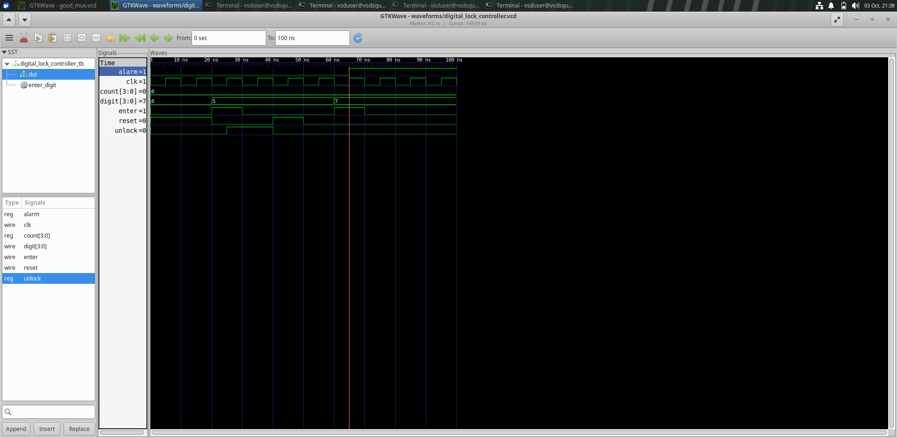
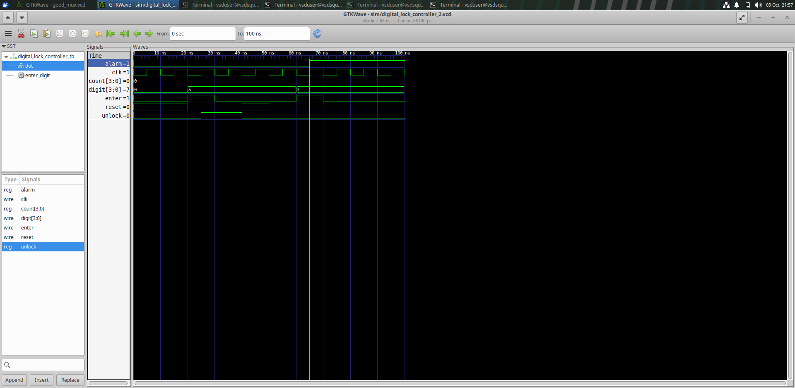

...

## Simulation Waveforms

### Correct Password / Unlock

The waveform shows the expected behavior for the correct password sequence, with the `unlock` output asserted.

### Incorrect Password / Alarm

The waveform shows the expected behavior for an incorrect password sequence, with the `alarm` output asserted.

## Simulation Files

The corresponding VCD waveform files are available in the `waveforms/` directory:

- `digital_lock_controller.vcd`
- `digital_lock_controller_2.vcd`
